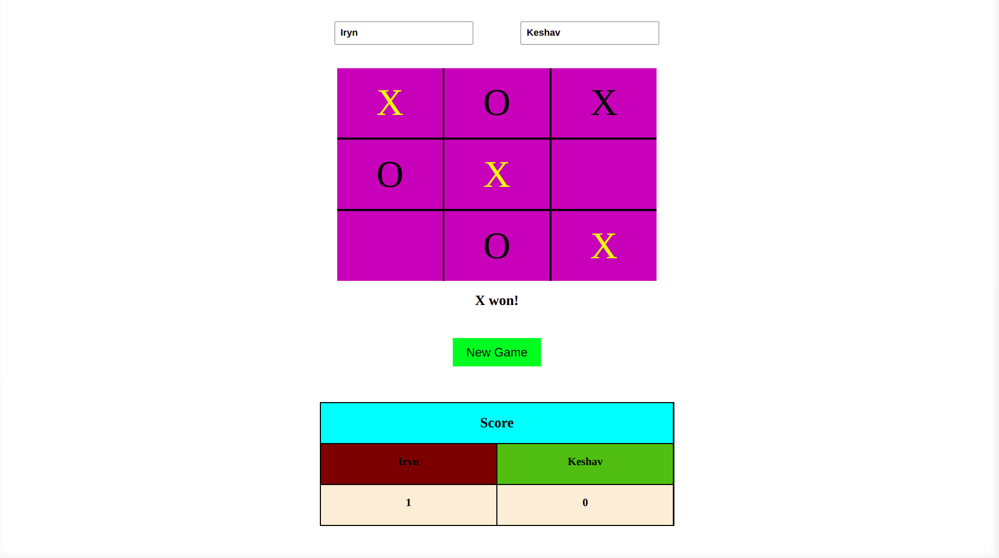

# Tic Tac Toe (JavaScript)

> This implements a game of Tic Tac Toe between two human opponents in JavaScript.

The game allows two players to enter their names and start playing. It also keeps count of the players' score.

## Built With

- JavaScript
- CSS
- HTML
- Webpack
- Jest

## Live Demo

[Github Pages Link](https://keshav-c.github.io/TicTacToe-js/tictactoe.html)

## Getting Started

To get a local copy up and running follow these simple example steps.

- clone the repository
- open `tictactoe.html` in your browser to start the game

### Run Unit Tests

`npm run test`

### Prerequisites

- Tested in Chrome, Firefox and Microsoft Edge. 

### Usage

- Enter the players' names to reset their individual score on the scoreboard.
- Click over the board until there the game ends.
- Click the `New Game` button to restart the game.
- Click the `Reset Game` button to wipe the board clean and reset the ongoing game.

## Authors

👤 **Keshav Chakravarthy**

- LinkedIn: [k3shavchakravarthy](https://www.linkedin.com/in/k3shavchakravarthy/)
- Github: [@keshav-c](https://github.com/keshav-c)

👤 **Mbabali Iryn**

- Github: [@mbabaliiryn](https://github.com/mbabaliiryn)
- Twitter: [@irynmbabali](https://twitter.com/irynmbabali)
- Linkedln: [mbabaliiryn](https://www.linkedin.com/in/mbabaliiryn)

## 🤝 Contributing

Contributions, issues and feature requests are welcome!

Feel free to check the [issues page](https://github.com/keshav-c/TicTacToe-js/issues).

## Show your support

Give a ⭐️ if you like this project!

## Acknowledgments

- Odin Project for the problem statement.
- Microverse for their guidance rubric.

## 📝 License

This project is [MIT](https://opensource.org/licenses/MIT) licensed.